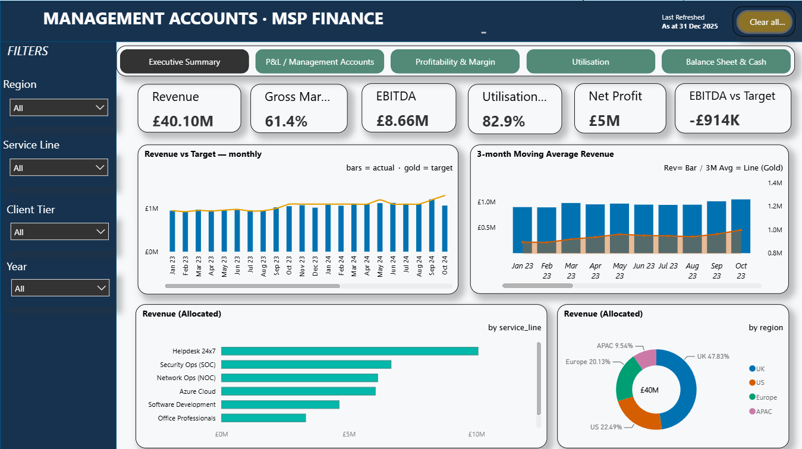
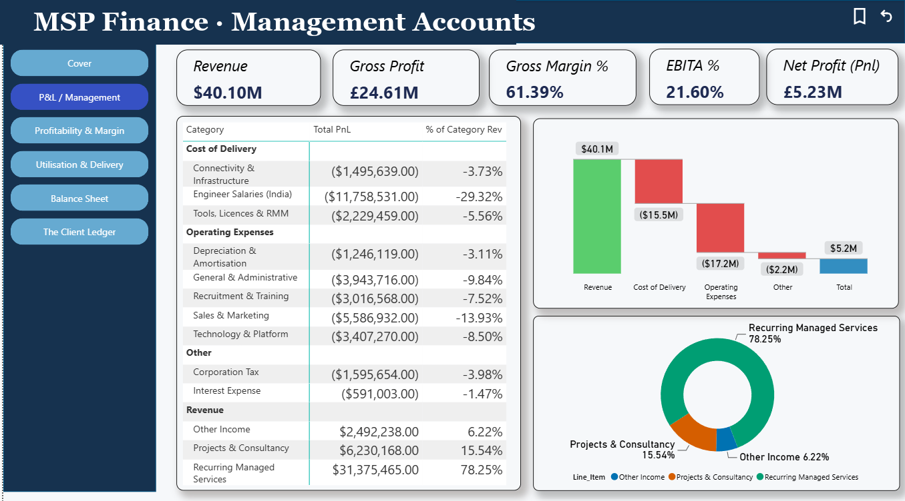
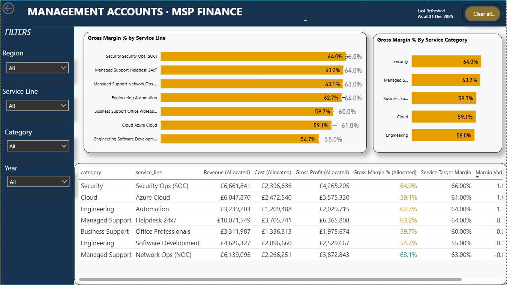
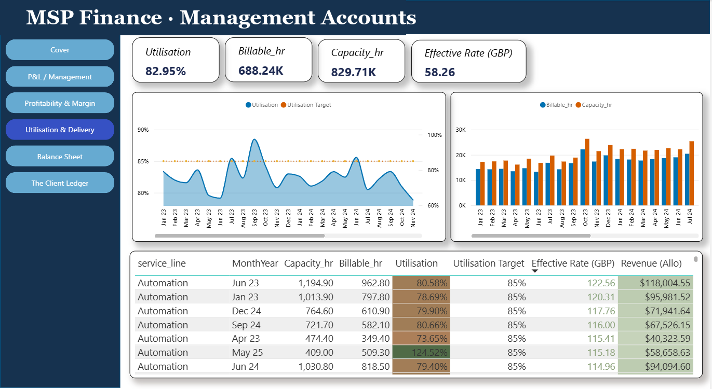
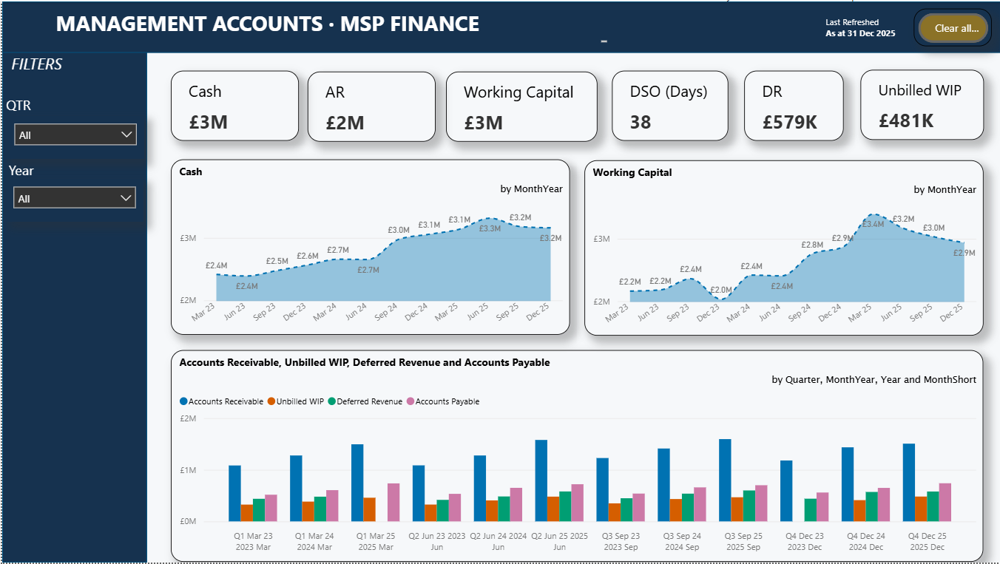
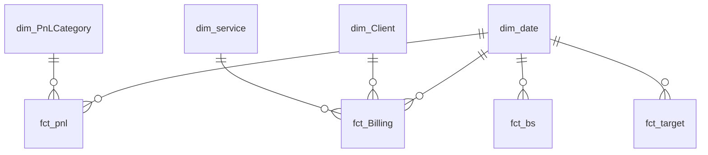

# 📊 MSP Management Accounts
### A Power BI finance dashboard for a Managed Service Provider

*Billing hours · P&L · Balance sheet — unified into one board-ready model where **every number reconciles to the audited accounts**.*

-116149?style=for-the-badge)

> ⚠️ **Synthetic data** — all figures are generated for demonstration. No real company data is included.

---

## 🖼️ Preview

| Executive Summary | P&L / Management Accounts | Profitability & Margin |
|:---:|:---:|:---:|
|  |  |  |
| **Utilisation** | **Balance Sheet & Cash** | |
|  |  | |

---

## 🔗 Live interactive value map

An interactive **dependency map** of the whole model — trace a single billable hour through **utilisation → billable rate → revenue → P&L → cash → the balance sheet**, filter by year, and read the plain-English story (and the *"so what would you do about it"*) behind every figure.

### ▶ **[Open the interactive value map »](https://kumar98rishav-oss.github.io/powerbi-msp-management-accounts/value-map.html)**

Six linked views on the same synthetic figures:

**Value Flow** · **Service Lines** · **Clients** · **Regions** · **P&L** *(waterfall vs plan)* · **Balance Sheet** *(Assets = Liabilities + Equity)*

*Self-contained HTML — no install, opens in any browser. Source: [`value-map.html`](value-map.html).*

---

## ✨ Why this project is interesting

> An MSP earns money by billing hours — but its finance team thinks in P&L, margin and cash. This model bridges the two, and does it **without ever contradicting the audited accounts**.

- 🎯 **Reconciled by design** — every client, service and month ties back to one audited revenue total (~£40M across 36 months).
- 🧠 **Smart revenue allocation** — where per-account revenue isn't reliable, the audited P&L is split by each account's **share of billable value**, and cost by its **share of actual delivery cost** — so margins vary *realistically* instead of collapsing to a flat average.
- 📐 **Real modelling depth** — semi-additive balance-sheet measures, a sign-convention P&L, common-size analysis, **Row-Level Security**, and full time intelligence (YoY, MoM, fiscal YTD, rolling 12-month, moving average).
- 🔍 **Insight, not just charts** — Key Influencers and a Decomposition Tree turn "what happened" into "why", and the design surfaces data-quality anomalies rather than hiding them.
- 🗂️ **Source-control friendly** — built in the **PBIP / TMDL** format, so the entire model and report are readable, diff-able text you can review right here on GitHub.

---

## 🧩 Data model — a clean star schema

| Fact tables | Grain | | Dimensions |
|---|---|---|---|
| `fct_pnl` | month × category × line item | | `dim_Client` — region, tier, industry, AM |
| `fct_Billing` | client × service × month | | `dim_service` — rate, target margin |
| `fct_bs` | balance-sheet item × quarter | | `dim_date` — conformed calendar |
| `fct_target` | metric × month (budget) | | `dim_PnLCategory` — P&L ordering |

*Single-direction relationships · conformed date dimension · no fact-to-fact joins.*

---

## 📑 Report pages

| # | Page | What it answers |
|---|------|-----------------|
| 1 | **Executive Summary** | Are we growing, profitable and on target? |
| 2 | **P&L / Management Accounts** | Where does each £ of revenue go? *(common-size P&L + waterfall)* |
| 3 | **Profitability & Margin** | Which services actually make money? *(margin vs target + quadrant)* |
| 4 | **Utilisation** | Are we using the capacity we pay for? *(gauge, Key Influencers, decomposition tree)* |
| 5 | **Balance Sheet & Cash** | Is the business healthy underneath the profit? *(cash, AR, working capital, DSO)* |

---

## 🧮 DAX highlights

- **Revenue allocation** — split the audited P&L by each account's share of billable value; cost by its share of actual cost → realistic, reconciled margins.
- **Semi-additive balance sheet** — cash / receivables read at the latest **quarter-end** (closing balance), never summed across periods.
- **Sign-convention P&L** — gross profit & EBITDA derived from a signed P&L (costs stored negative), so subtotals are simple sums.
- **Common-size P&L** — every line as a % of revenue, using `REMOVEFILTERS` so the denominator stays total revenue.
- **Time intelligence** — `SAMEPERIODLASTYEAR`, `TOTALYTD` (fiscal), `DATESINPERIOD` (rolling 12-month), and a 3-month moving average.

---

## ▶️ Run it yourself

The synthetic data is included under **`/data`**, so the report is fully reproducible.

1. **Clone** this repo.
2. **Open** `MSP Management Accounts.pbip` in Power BI Desktop (Dec 2023 or later).
3. Set the **`pFolder`** parameter to the path of the **`data`** folder in your clone — *Home → Transform data → `pFolder` → Current Value* — then **Refresh**.

---

## 🛠️ Built with

Power BI Desktop · **PBIP** project format · **TMDL** semantic model · **DAX** · **Power Query (M)** · Row-Level Security

---

### 👤 Author

**Rishav Kumar** — Power BI Developer / Data Analyst
Microsoft **PL-300** Certified · ~5 years in data analytics (legal & healthcare domain)

⭐ *If you find this useful, a star is always appreciated!*

